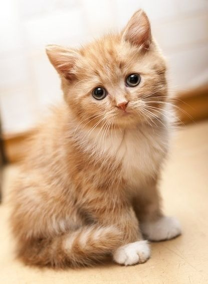

```{r setup, include=FALSE}
options(htmltools.dir.version = FALSE)

```

class: inverse, center, middle

# Forcats Package

-This package is used when you want to do things with categorical data

--

-i.e. different levels or conditions  of an experiment

---
class: inverse, center, middle

# Why I chose this Package

```{r echo=FALSE}



```

---

class: inverse, center, middle

# Getting Started

Install the **forcats** package from [Github](https://github.com/tidyverse/forcats):

```{r eval=FALSE, tidy=FALSE}
devtools::install_github("tidyverse/forcats")

```

--

-Forcats is part of Tidyverse

--

-You can install the package tidyverse which will also install forcats

--

-or you can use devtools to get straight to forcats


---

class: inverse, center, middle

# You Have it Installed, Now What?

-Do you have categorical data?

--

-Do you want to do something with that categorical data?

--

-Use forcats and it's dependicies to do that thing with categorical data


---

class: inverse, center, middle

# What you Can do With Forcats

-Reordering a factor with a variable 

--

-Use fct_reorder()

--

-Reordering a factor by frequency

--

-Use fct_infreq()

--

-Changing the order of the factors by hand

--

-Use fct_relevel()

--

-Collapsing the values of a factor into and "other" category

--

-Use fct_lump()


---
class: inverse, center, middle

# Why do we care?

-Heres some examples

```{r include=FALSE}

library(forcats)
library(dplyr)
library(ggplot2)

```

```{r echo=FALSE}
knitr::include_graphics("images/1200px-Star_wars2.svg.png")
```

---
class: inverse, center, middle

# Using fct_lump()
```{r}
starwars %>%
  filter(!is.na(species)) %>%
  mutate(species = fct_lump(species, n = 3)) %>%
  count(species)
```

---
class: inverse, center, middle

# Using fct_infrequ()

```{r}
starwars %>%
  mutate(eye_color = fct_infreq(eye_color)) %>%
  ggplot(aes(x = eye_color)) + 
  geom_bar() + 
  coord_flip()
```


